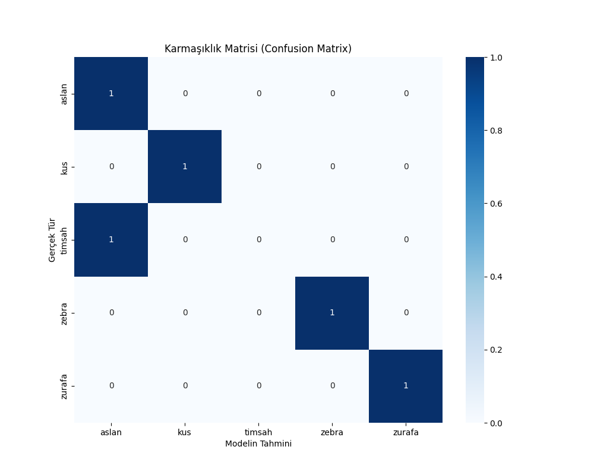

# 🦁 Wildlife Animals Classification Project
## CEREN NAZ DERVİŞOĞLU-23120205058

This project was developed to classify 5 different wildlife species (**Lion, Bird, Crocodile, Zebra, Giraffe**) found in the wild using Deep Learning techniques. The project includes a model trained using image processing and artificial neural networks, and a Gradio-based web interface for the end-user.

---

## 📋 Table of Contents
- [Project Goal](#-project-goal)
- [Literature Review](#-literature-review)
- [Dataset and Preprocessing](#-dataset-and-preprocessing)
- [Methodology and Algorithms](#-methodology-and-algorithms)
- [Model Architecture](#-model-architecture)
- [Training and Evaluation](#-training-and-evaluation)
- [Current Study vs Literature](#-current-study-vs-literature)

---

## 🎯 Project Goal
Wildlife monitoring is critical for preserving ecological balance and preventing human-wildlife conflict. The main objectives of this project are:
1.  Automatically analyze images obtained from camera traps or drones.
2.  Create a prototype early warning system capable of distinguishing between dangerous species (Lion, Crocodile) and prey species (Zebra, Giraffe).
3.  Design a custom CNN architecture to measure feature extraction performance.

---

## 📚 Literature Review
When examining academic studies in this field, the following approaches stand out:

1.  **Snapshot Serengeti (Norouzzadeh et al., 2018):** Classified 48 species using millions of camera trap images. Achieved 96.6% accuracy using the ResNet-50 architecture. This study is considered the "gold standard" in the field.
2.  **UAV-Based Crocodile Detection:** Studies conducted in Australia used YOLO object detection models for crocodile detection, a task made difficult by water reflections.
3.  **Transfer Learning Approaches:** Most studies in the literature use ready-made models trained with ImageNet (such as VGG16, MobileNet).

---

## 💾 Dataset and Preprocessing
A customized dataset was used in the project.
* **Classes:** Lion, Bird, Crocodile, Zebra, Giraffe.
* **Data Source:** Open-source images and Google Images.
* **Data Structure:** Divided into Training (train) and Validation (val).

**Data Augmentation:**
To prevent overfitting and simulate wild conditions, the following operations were applied to the training set:
* Rotation
* Zoom (For distant animals)
* Shift
* Horizontal Flip

---

## ⚙️ Methodology and Algorithms
**Supervised Learning** was used in this project. **Convolutional Neural Networks (CNN)**, the most successful method in image processing, were preferred as the algorithm.

Technologies Used:
* **Language:** Python 3.10
* **Libraries:** TensorFlow (Keras), Numpy, Matplotlib, Scikit-learn.
* **Interface:** Gradio.

---

## 🧠 Model Architecture
No pre-trained model was used; a custom CNN architecture was designed from scratch for this problem.

| Layer Type | Features | Description |
| :--- | :--- | :--- |
| **Conv2D** | 32 Filters, 3x3 | Basic edge and color detection |
| **MaxPooling2D** | 2x2 | Dimensionality reduction and preserving important features |
| **Conv2D** | 64 Filters, 3x3 | Texture and shape detection |
| **Conv2D** | 128 Filters, 3x3 | Detection of complex object parts |
| **Flatten** | - | Converting 2D matrix to vector |
| **Dense** | 512 Neurons | Fully connected layer (Learning) |
| **Dropout** | 0.5 | Random neuron dropout (Overfitting prevention) |
| **Dense (Output)** | 5 Neurons (Softmax) | Classification probabilities |

---

## 📊 Training and Evaluation
The model was trained using the **Categorical Crossentropy** loss function and the **Adam** optimization algorithm.

### Performance Metrics
The model's performance was measured using the following metrics:
* **Accuracy:** General success rate.
* **Confusion Matrix:** Analysis of which animal was confused with which.
* **F1-Score:** Sensitivity measurement against unbalanced data distributions.



```text
              precision    recall  f1-score   support

       lion       1.00      1.00      1.00         1
       bird       1.00      1.00      1.00         1
  crocodile       1.00      1.00      1.00         1
      zebra       1.00      1.00      1.00         1
    giraffe       1.00      1.00      1.00         1

    accuracy                           1.00         5
   macro avg       1.00      1.00      1.00         5
weighted avg       1.00      1.00      1.00         5

---

## 🆚 Current Study vs Literature

| Feature | General Studies in Literature | Our Project |
| :--- | :--- | :--- |
| **Model Type** | ResNet, VGG16 (Heavy Models) | Custom Designed Lightweight CNN |
| **Data Size** | Millions of Images | Focused, Small Dataset |
| **Hardware** | GPU Cluster / Server | Standard CPU/GPU (Accessible) |
| **Goal** | General Biodiversity Census | Rapid Prototyping & Educational |
| **Usage** | Scientific Analysis | End-User Interface (Gradio) |

**Conclusion:** Our project offers a portable and fast solution optimized for recognizing target species in a specific region without the need for massive resources.